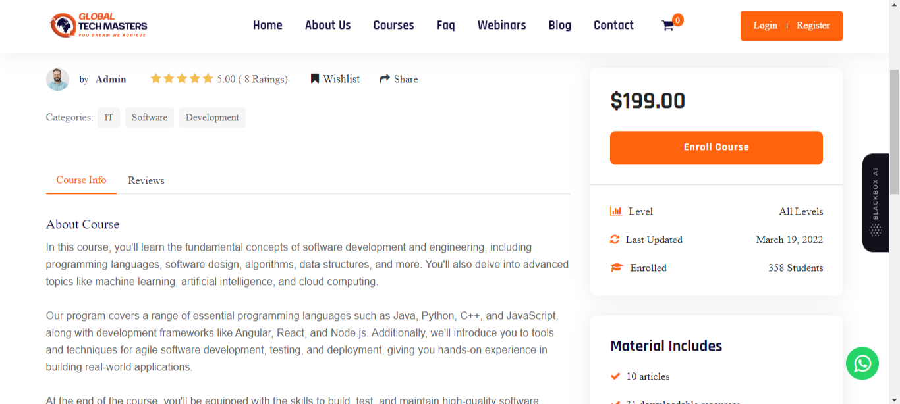
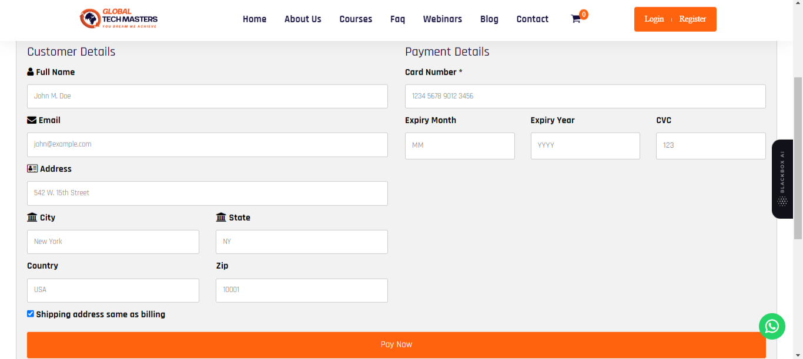

# Project Name: Course Selling Platform using PHP

## Overview

Welcome to the README file for my project, Course Selling Platform using PHP. This document provides a detailed insight into the project, showcasing the challenges faced, solutions implemented, technologies employed, and the PHP skills demonstrated during its development.

## Project Description

The Dynamic Online Course Platform is the result of a collaborative venture between myself and a fellow developer. This endeavor was conceived to fulfill the requirements of a UK-based client. While the project initially commenced as a static showcase, it swiftly transformed into a dynamic hub for marketing and selling online courses. The driving force behind this transformation was a sophisticated utilization of PHP.

## My Role and Team Collaboration

As a freelancer, I embarked on a collaborative journey with a fellow developer to fulfill a client's requirements. Our project, Course Selling Platform using PHP, demanded an innovative blend of skills and dedication.

### My Role

I was responsible for the following key aspects:

- Designing and implementing dynamic features using core PHP.
- Managing database interactions and ensuring data integrity.
- Collaborating with my teammate to integrate frontend components seamlessly.
- Implementing user authentication and authorization protocols.
- Overcoming challenges and fine-tuning the project to meet the client's needs.

### Team Collaboration

My colleague and I collaborated closely throughout the development process. Together, we established a private GitHub repository, allowing us to work efficiently and maintain a clean codebase. Regular code pushes and reviews ensured our progress remained steady.

## Proficiency in PHP and Backend Architecture

At the heart of this project's triumph lies our mastery of PHP—a foundational element that enabled the creation of dynamic content and seamless interactions. Through PHP's robust capabilities, we engineered a system mirroring the structure of blogs, meticulously tailored to accommodate course creation and sales. This experience is a testament to my profound understanding of PHP's versatility and functionality.

## Technologies and Challenges

### Technologies Used

- **Frontend:** HTML, CSS, JavaScript, Bootstrap
- **Backend:** PHP
- **Database:** MySQL
- **Payment Gateway:** Razorpay

### Challenges and Solutions

#### Challenge: Transitioning to a Dynamic Platform

When the client requested a transition from a static to a dynamic website for selling courses, it posed a significant challenge.

#### Solution: Harnessing PHP for Dynamism

We revamped the project, employing PHP to create a dynamic platform. Using PHP posts similar to blogs, we allowed the admin to add courses, which users could purchase and provide feedback on.

#### Challenge: Payment Gateway Integration

Integrating Razorpay for payments was uncharted territory for us.

#### Solution: Learning and Implementation

We turned to YouTube to learn how to integrate Razorpay smoothly. Our resourcefulness allowed us to establish a secure and efficient payment gateway.

## Learning and Growth

Throughout the development process, I embraced a learning-oriented approach. Each challenge was an opportunity to expand my knowledge.

### YouTube as a Learning Resource

For unfamiliar sections, I leveraged YouTube as a learning resource. This was particularly evident in integrating Razorpay for payments, where YouTube tutorials guided me through the process.

### PHP Advantages and Functionality Exploration

This project exposed me to the diverse advantages and functionalities of PHP. From dynamic content creation to handling transactions, I harnessed the power of PHP to meet the project's requirements.

## Project Showcase

The culmination of our effort resulted in the launch of a live online course platform, accessible at [https://globaltechmasters.com/](https://globaltechmasters.com/). The footer proudly attributes the platform's creation to "Developed By: Divyanshu And Daksh," commemorating our collaborative dedication. This project underscores the potential of collaborative endeavors, the transformative power of real-time learning, and PHP's role in crafting dynamic web solutions.

Due to confidentiality agreements, the comprehensive codebase cannot be shared on GitHub. However, I am enthusiastic about the prospect of discussing my pivotal role, technical solutions, and PHP expertise during interviews.

## Screenshots

<table>
  <tr>
    <tr>
    <td align="center">
      
    </td>
    <td align="center">
      
    </td>
  </tr>
  <tr>
    <td align="center">
      
    </td>
    <td align="center">
      
    </td>
  </tr>
  <tr>
    <td align="center">
      
    </td>
    <td align="center">
      
    </td>
  </tr>
</table>

## Contact

For a deeper exploration of this project, or to engage in conversations about my contributions and the pivotal role PHP played in its realization, feel free to connect with me at:
dakshsahu24@gmail.com
